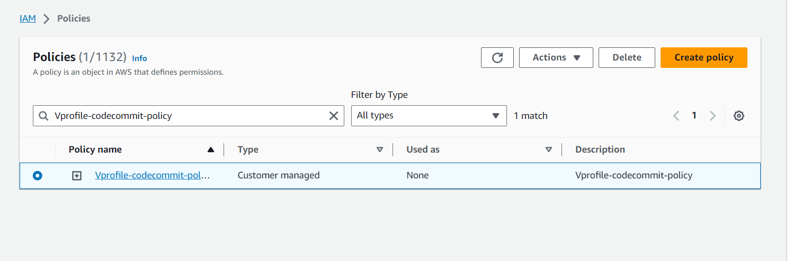
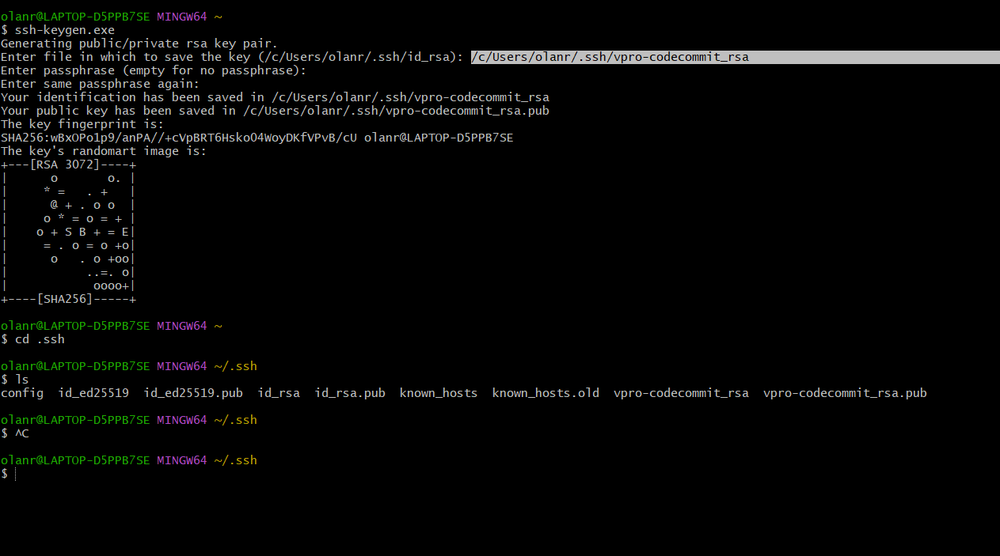
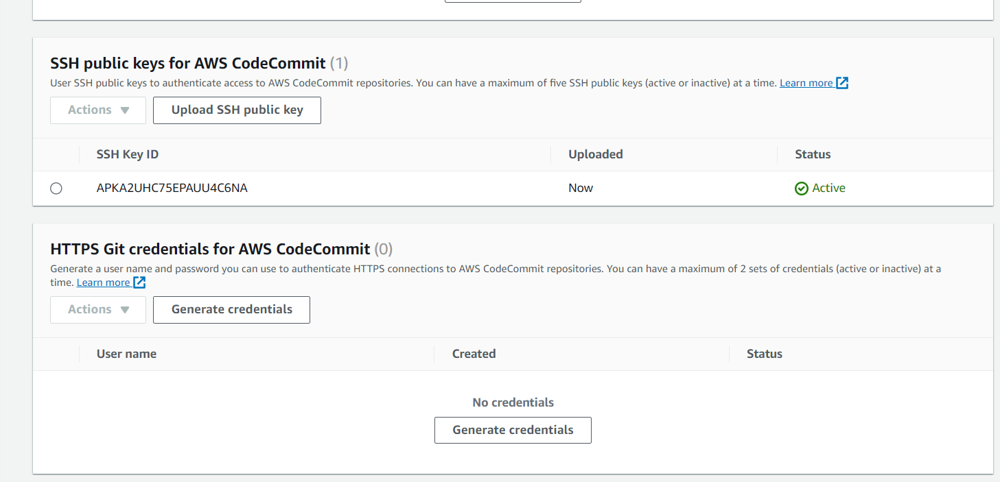
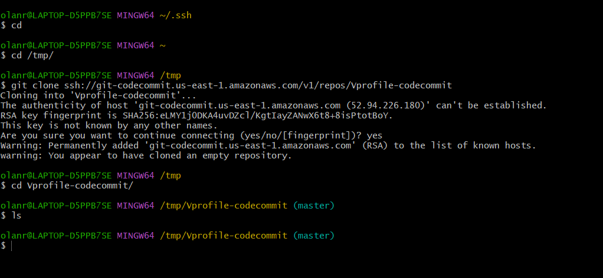
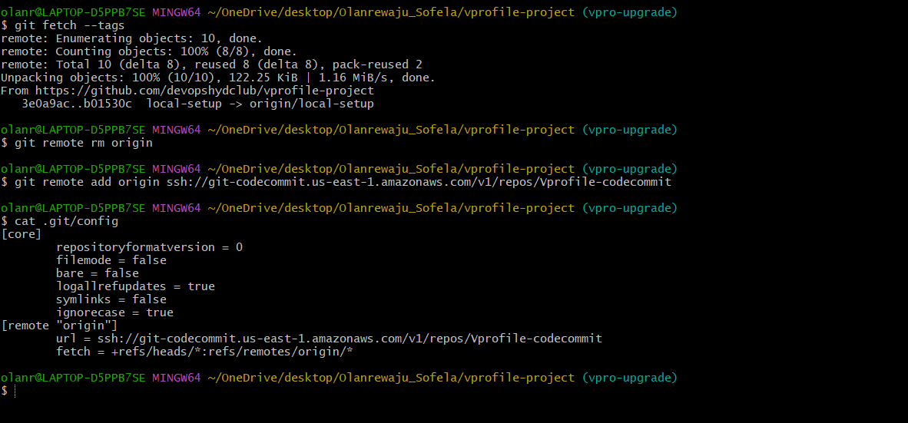
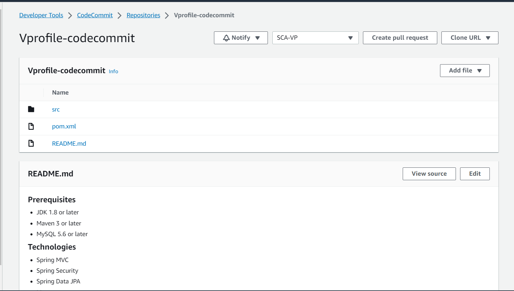
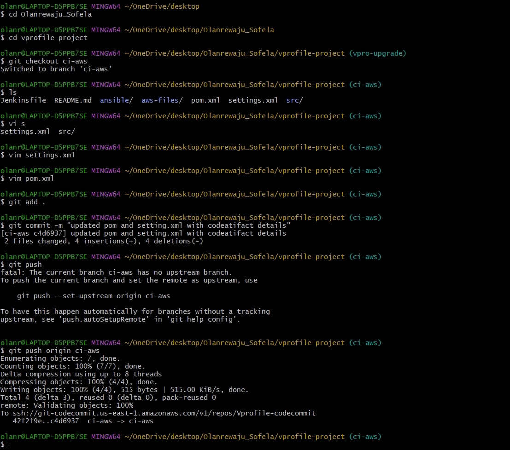
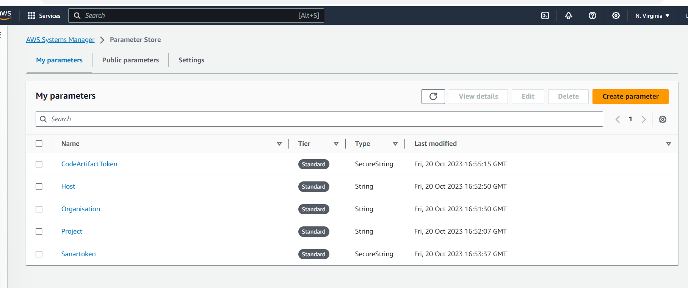
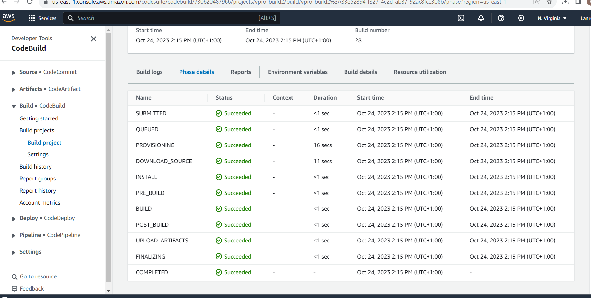
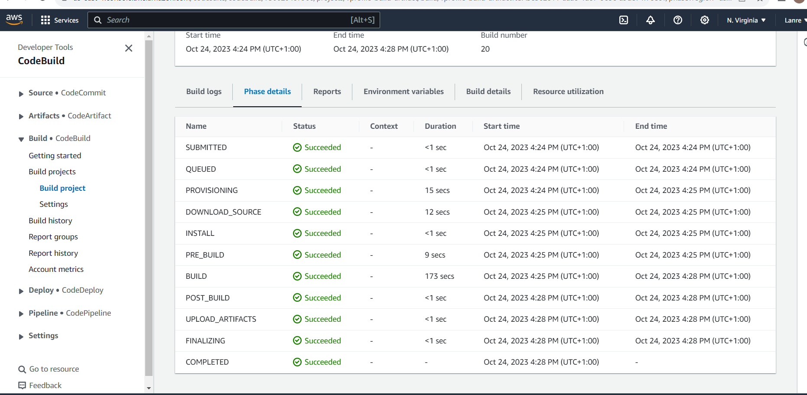

# Continuous-Integration-on AWS-Cloud

## This is the use of continuious integration pipeline on AWS. The following is the flow of execution :
1. AWS account
2. Code Commit 
   * Create codecommit repo
   * Create iam user with codecommit policy
   * Generate ssh keys locally
   * Exchange keys with iam user
   * Put source code from github repo to cc repository and push
3. Code Artifact
   * Create an IAM user with code artifact access
   * Install AWS CLI, configue
   * Export auth token
   * Update settings .xml file in source code top level directory with below details
   * Update pom.xml file with repo details
4. Setting up Sonar Cloud
   * Create sonar cloud account
   * Generate token
   * Create SSM parameter with sonar details
   * Create Build project
   * Update codebuild role to access SSMparameter
5. Create notification for sns or slack
6. Build Project
   * Upadte pom.xml with artifact version with timestamp
   * Create variable in SSM => parameterstore
   * Create Build Project
   * Update codebuild role to access SSMparameterstore
7. Create Pipeline
   * Codecommit
   * Testcode
   * Build
   * Deploy to s3 bucket
8. Test Pipeline

### We will go to codecommit on AWS console and create a repository, we are accessing the repository thru SSH. In order to connect to SSH we will create IAM user that will have access to the service.
### In the IAM user, we create policy because we want only need policy for the repository we created. 

### We need ssh keys for a codecommit, so we have to upload ssh public key. We will generate ssh keys from our local machine

`ssh-keygen.exe`
### Changing the keys name and keeping the keys in that location

`/c/Users/olanr/.ssh/vpro-codecommit_rsa`

### Upload the public key to the SSH public keys for AWS CodeCommit of the IAM user

### We will create a config file and edit the Host, User, and Identityfile as follows

`Host git-codecommit.*.amazonaws.com
   User APKA2UHC75EPAUU4C6NA
   IdentityFile ~/.ssh/vpro-codecommit_rsa`

### Change the config file permission to 600  
`chmod 600 config`

### Let's make a test with our credentails
`ssh git-codecommit.us-east-2.amazonaws.com`

### To clone repository
`cd /tmp/`

`git clone ssh://git-codecommit.us-east-1.amazonaws.com/v1/repos/Vprofile-codecommit`

### Checkout all the branches at onces
`for i in `cat /tmp/branches`; do git checkout $1;done`
### Fecting Tags
`git fetch --tags`
### Removing the remote origin
`git remote rm origin`
### Add code commit repository
`git remote add origin ssh://git-codecommit.us-east-1.amazonaws.com/v1/repos/Vprofile-codecommit `
### Validating from config file
`cat .git/config`

### Push to codecommit
`git push origin --all`
### push tags
`git push --tags`

## Code Artifact
### We will create repository in code Artifact console 
### Creating iam user for export of the variable, get the Retrieve access keys and run from your local machine

`aws configure`

Insert as follows
* AWS Access Key ID
* AWS Secret Access key
* Default Region
* Default output format(json) 

### Copy the  Export a CodeArtifact authorization token for authorization to your repository from your preferred shell to access the token on your local machine
### In our local machine, we switch to ci-jenkins branch and make the following changes in the settings.xml file

* the repository url to `visualpath-730620487966.d.codeartifact.us-east-1.amazonaws.com/maven/maven-central-store/</url>`
* the mirror url to `https://visualpath-730620487966.d.codeartifact.us-east-1.amazonaws.com/maven/maven-central-store/</url>`

### We will also update our porm.xml file

* the url to `https://visualpath-730620487966.d.codeartifact.us-east-1.amazonaws.com/maven/maven-central-store/</url>`

### We commit the changes
`git add .`

`$ git commit -m "updated pom and setting.xml with codeatifact details"`
`$ git push origin ci-aws`

## SonaCloud Setup

### We are setting up a code analysis job, which is going to do some code analysis in code build in Sonar cloud account

* We generate a token from the Sonar Cloud account
* Create project manually
* Save name of organization, key, url

## AWS  System Manager Parameter Store for SonarDetails
### We open the system parameter console to store variable, From the parameter store we are going to create parameter for the following
* Organzation
* Project
* Host
* SonarToken
* And lastly CodeArtifact Auth. Token

## AWS CodeBuild for SonarQube Code Analysis
### We create buid project, the first bulid job will be to do code analysis, In the BUILDSPEC, we copy and paste our buildspec file context in  (cat aws-files/sonar_buildspec.yml)from ci-aws branch. And we edit the parameter value as seen below 

* LOGIN = Sanartoken
* HOST  = HOST
* Organization = Organisation
* Project = Project
* CODEARTIFACT_AUTH_TOKEN = CodeArtifactToken

`version: 0.2
env:
  parameter-store:
    LOGIN: Sanartoken
    HOST: HOST
    Organization: Organisation
    Project: Project
    CODEARTIFACT_AUTH_TOKEN: CodeArtifactToken
phases:
  install:
    runtime-versions:
      java: openjdk8
    commands:
    - cp ./settings.xml /root/.m2/settings.xml
  pre_build:
    commands:
      - apt-get update
      - apt-get install -y jq checkstyle
      - wget https://dlcdn.apache.org/maven/maven-3/3.9.4/binaries/apache-maven-3.9.4-bin.tar.gz
      - tar xzvf apache-maven-3.9.4-bin.tar.gz
      - ln -s apache-maven-3.9.4 maven
      - wget https://binaries.sonarsource.com/Distribution/sonar-scanner-cli/sonar-scanner-cli-3.3.0.1492-linux.zip
      - unzip ./sonar-scanner-cli-3.3.0.1492-linux.zip
      - export PATH=$PATH:/sonar-scanner-3.3.0.1492-linux/bin/
  build:
    commands:
      - mvn test
      - mvn checkstyle:checkstyle
      - echo "Installing JDK11 as its a dependency for sonarqube code analysis"
      - apt-get install -y openjdk-11-jdk
      - export JAVA_HOME=/usr/lib/jvm/java-11-openjdk-amd64
      - mvn sonar:sonar -Dsonar.login=$LOGIN -Dsonar.host.url=$HOST -Dsonar.projectKey=$Project -Dsonar.organization=$Organization -Dsonar.java.binaries=target/test-classes/com/visualpathit/account/controllerTest/ -Dsonar.junit.reportsPath=target/surefire-reports/ -Dsonar.jacoco.reportsPath=target/jacoco.exec -Dsonar.java.checkstyle.reportPaths=target/checkstyle-result.xml
      - sleep 5
      - curl https://sonarcloud.io/api/qualitygates/project_status?projectKey=$Project >result.json
      - cat result.json
      - if [ $(jq -r '.projectStatus.status' result.json) = ERROR ] ; then $CODEBUILD_BUILD_SUCCEEDING -eq 0 ;fi`

### Before we test our job we will update Role that we have used, we have to give the privilege so it can access some parameters      

## AWS CodeBuild for Build Artifact
### We will create the next job that will build the Artifact,In the BUILDSPEC, we copy and paste our buildspec file context in  (cat aws-files/build_buildspec.yml)from ci-aws branch. And we edit the parameter value as seen

`version: 0.2
env:
  parameter-store:
    CODEARTIFACT_AUTH_TOKEN: CODEARTIFACT_AUTH_TOKEN
phases:
  install:
    runtime-versions:
      java: corretto8
    commands:
      - cp ./settings.xml /root/.m2/settings.xml
  pre_build:
    commands:
      - apt-get update
      - apt-get install -y jq
      - wget https://dlcdn.apache.org/maven/maven-3/3.9.4/binaries/apache-maven-3.9.4-bin.tar.gz
      - tar xzvf apache-maven-3.9.4-bin.tar.gz
      - ln -s apache-maven-3.9.4 maven
  build:
    commands:
      - mvn clean install -DskipTests
artifacts:
  files:
     - target/**/*.war
  discard-paths: yes`

  ### Before we test our job we will update Role that we have used, we have to give the privilege so it can access some parameters 
  

## AWS CodePipeline & Notification with SNS

### We will ste up notification before we setup pipeline, The notification will be setup with Amazon SNS(Simple Notification Service), We will create Topic in the SNS

###  We will create pipeline and create s3 buckect to save the artifact

The End

